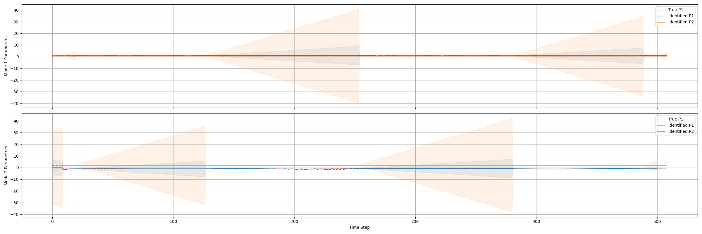
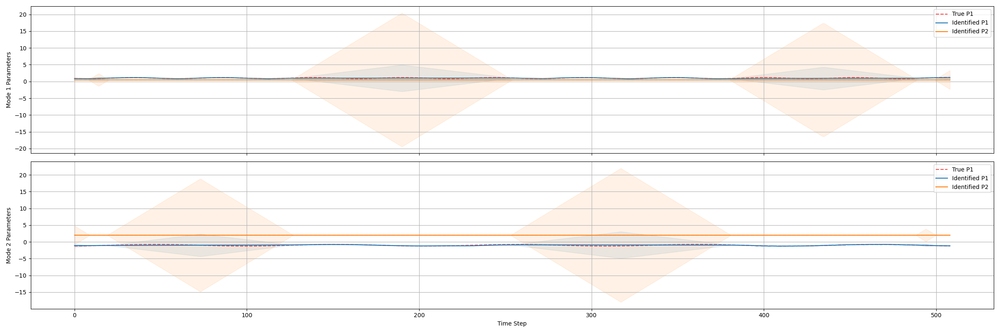
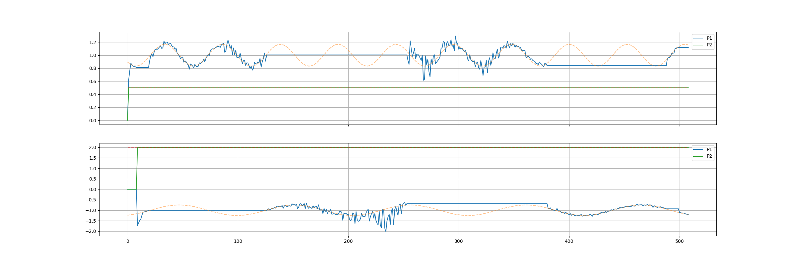
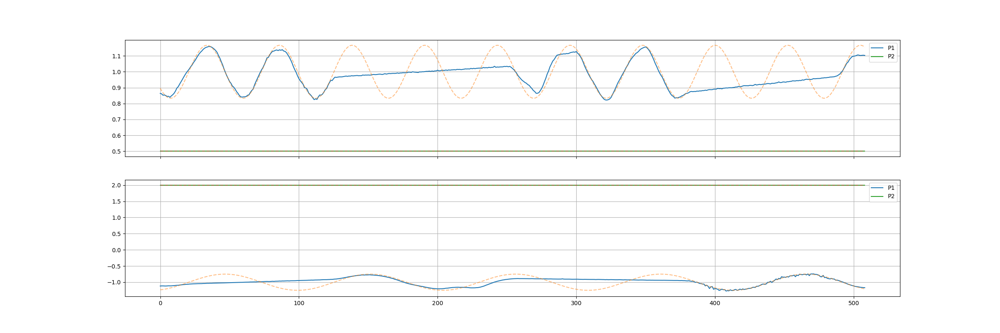

# Data Analysis Through Physical Models' Parameters Variations

[](https://www.python.org/downloads/)
[](https://www.python.org/downloads/)
[](https://opensource.org/licenses/MIT)

This repository contains a Python port of a MATLAB research codebase aimed at analyzing data through the time-variation of model parameters. The parameter identification method is designed to work with non-linear multi-mode models.

The primary difference from a standard Bayesian Sequential Monte-Carlo (BSMC) identification scheme is that this SMC approach is used for single-timestamp iterative identification, combined with a time-filtering based weighting approach to smooth estimates over time. This methodology explicitly considers time-variations, whereas BSMC handles them implicitly through the prior distribution.

*Note: This Python port does not yet fully support multi-mode models without explicit mode separation.*

## Bayesian SMC VS Filtered SMC

### - Uncertainty estimation

**Bayesian SMC**


**Filtered SMC**


### - Data filtering and extrapolation

*Example using synthetic data with added noise.*

**Bayesian SMC**


**Filtered SMC**


### - Speed

**Bayesian SMC**
```
==================================================
IDENTIFICATION PROBLEM SUMMARY
--------------------------------------------------
Number of Input Regressors: 1
Number of Modes:           2
Total Parameters per Mode: 2 (incl. bias)

Fitted Parameters by Mode:
Mode 1: 1 fitted [0] | 1 fixed to theta_true
Mode 2: 1 fitted [0] | 1 fixed to theta_true
--------------------------------------------------
Likelihood:   cauchy (sigma_obs: 0.5)
Resampling:   Stochastic
==================================================


[INFO] Starting BSMC Parameter Identification...

100%|█████████████████████████████████████████████████████████████████████████████████| 2/2 [00:00<00:00, 34239.22it/s]
Elapsed time (core): 0.1682s
```

**Filtered SMC**
```
==================================================
IDENTIFICATION PROBLEM SUMMARY
--------------------------------------------------
Number of Input Regressors: 1
Number of Modes:           2
Total Parameters per Mode: 2 (incl. bias)

Fitted Parameters by Mode:
Mode 1: 1 fitted [0] | 1 fixed to theta_true
Mode 2: 1 fitted [0] | 1 fixed to theta_true
--------------------------------------------------
Likelihood:   cauchy (sigma_obs: 0.5)
Resampling:   Stochastic
==================================================


[INFO] Starting Filtered SMC Parameter Identification...

Iteration 1/20
Iteration 2/20
Iteration 3/20
Iteration 4/20
Iteration 5/20
Iteration 6/20
Iteration 7/20
Iteration 8/20
Iteration 9/20
Iteration 10/20
Iteration 11/20
Iteration 12/20
Iteration 13/20
Iteration 14/20
Iteration 15/20
Iteration 16/20
Iteration 17/20
Iteration 18/20
Iteration 19/20
Iteration 20/20
Elapsed time (core): 0.1793s
```


## Quickstart / Quicklaunch (No Installation Required)


You can instantly try the parameter identification schemes on synthetic data without manually setting up a Conda environment by using [uv](https://github.com/astral-sh/uv). `uv` will automatically resolve dependencies, create a temporary isolated environment, and execute the algorithm.

To run the Bayesian Sequential Monte-Carlo (BSMC) identification on a PWARX model:
```bash
uv run quicklaunch_pwarx_bsmc.py
```

To run the iterative Filtered Sequential Monte-Carlo (FSMC) identification on the same model:
```bash
uv run quicklaunch_pwarx_fsmc.py
```

Results, including `.csv` parameter traces and evaluation `.png` plots, will be automatically saved in a timestamped folder under the `results/` directory.

## Installation

```bash
conda create -n TVPI python=3.14
conda activate TVPI
pip install -r tvpi/requirements.txt
```

## Usage

```bash
python main.py
```

This script loads experimental Excel datasets, applies preprocessing and mode clustering, runs the iterative SIR identification with moving average smoothing, and generates parameter evolution plots with uncertainty bands. Results are saved to `identification_results.json`.

### Running Tests

```bash
python tvpi/tests/test_sir_filter.py
```

Tests verify recovery of known sinusoidal parameter trajectories (both low- and high-frequency) from synthetic data, reproducing the numerical validation experiments of the reference paper.

## Motivation and Intended Use

Hybrid dynamical system models — models that combine continuous dynamics with discrete mode-switching — have broad applications in domains. A recurrent challenge in fitting these models to real-world data is that their parameters, while physically meaningful, are not truly constant over time (e.g., for vehicles traffic flow modeling, a driver's maximum comfortable deceleration or desired speed varies with fatigue, traffic context, and mood).

Standard identification methods for hybrid systems focus on time-invariant parameters. When time-varying characteristics are considered, prior Bayesian particle filtering methods typically propagate parameter estimates causally forward in time. This implicitly encodes parameter dynamics through a prior probability density, making it difficult to separately tune the identification process and the time-smoothing constraint.

The filtered SMC method implemented in this package was developed to address this gap: to **explicitly and separately control the parameter identification process and the parameter time-dynamics filtering**, while remaining applicable to nonlinear, non-differentiable, heterogeneous hybrid system models for which a closed-form solution is otherwise unavailable.

**This framework is highly suited for situations where:**

- The hybrid system model structure (or other nonlinear expert model) is known.
- Parameters have a direct physical meaning that must be preserved.
- Parameters are expected to vary over time, and their timescale of variation is approximately known.
- The parameter space is low-dimensional (scalar or a small vector per mode).
- The goal is physical analysis and interpretation.

## Non-Regression Testing

To prevent unintended behavior changes when modifying the core optimizer (`tvpi/core/optim.py`), the project includes a non-regression testing framework. This framework guarantees that new code changes do not alter the established parameter identification outputs.

The framework is located in `tests/regression/` and uses static JSON configurations and fixed random seeds to compare current outputs against pre-generated "golden" baselines (`expected.npy`).

**Run the regression test suite:**
```bash
python tests/regression/batch_launcher.py
```

**Update baselines (after a validated algorithmic improvement):**
```bash
python tests/regression/batch_launcher.py --update-baseline
```

## Project Structure

```
tvpi/
├── core/         # SIR filter, iterative smoother, plotting
├── models/       # PWARX and Gipps model implementations
├── data/         # Data loading, Excel parsing, mode clustering
├── tests/        # Non-regression testing
└── results/      # Identifications results storage
```

## Note on the Python Port

This Python implementation is a functional port of the MATLAB research code used in the publications below. The numerical logic — weighting functions, resampling strategy, smoothing procedure, and initialization — has been preserved.
Improvements have been done to:

- the code structure,
- computation is vectorized,
- added stochastic resampling,
- added smoothed anchors (time-filtered anchors for linear extrapolation),
- added safe anchors (time margin between mode switch),
- added filtering distribution choice,
- added computation precision (float32/64),
- added point estimation from argmax, or top-N% MMSE point extraction.
- added auto-convergence detection.

This port does not include:

- closed-loop system identification,
- modes segmentation identification.

## Citation

If you use this code in your research, please cite the original publications:

```bibtex
@article{Wilhelem2017,
  title={Identification of time-varying parameters of hybrid dynamical system models and its application to driving behavior},
  author={Wilhelem, Thomas and Okuda, Hiroyuki and Suzuki, Tatsuya},
  journal={IEICE Transactions on Fundamentals of Electronics, Communications and Computer Sciences},
  volume={E100.A},
  number={10},
  pages={2095--2105},
  year={2017},
  doi={10.1587/transfun.E100.A.2095}
}

@inproceedings{Wilhelem2016,
  title={SMC-based time-varying parameter identification for driving behavior modeling},
  author={Wilhelem, Thomas and Okuda, Hiroyuki and Suzuki, Tatsuya},
  booktitle={IEEE International Conference on Systems, Man, and Cybernetics (SMC)},
  year={2016},
  doi={10.1109/SMC.2016.7844694}
}
```

## Disclaimer

This software is provided for academic and research purposes only. It is provided "as is" and without any warranty of any kind, express or implied, including but not limited to the warranties of merchantability, fitness for a particular purpose and noninfringement. In no event shall the authors or copyright holders be liable for any claim, damages or other liability, whether in an action of contract, tort or otherwise, arising from, out of or in connection with the software or the use or other dealings in the software.

**Safety-Critical Applications Note:** While this codebase includes examples related to automotive control and driver behavior (e.g., Gipps car-following model), this code is experimental. It has not been validated for and must **not** be used in any safety-critical, production, or real-world autonomous driving and advanced driver-assistance systems (ADAS).

## License

BSD 3-Clause License — see LICENSE file for details.
